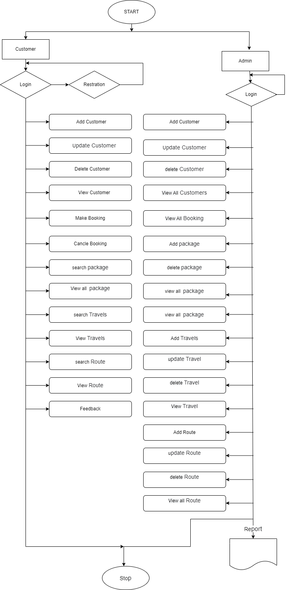
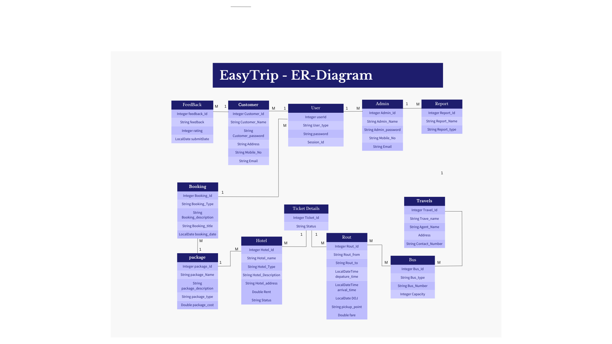

# EasyTrip

# Online trip management system
A Trip Management System is a software application that allows users to plan, organize, and manage various aspects of their trips, such as destinations, travels, bookings.


## Logo


<!-- 
## Flowchart

 -->


## Entity Relationship Diagram



## Tech Stack

* Java
* Spring Framework
* Spring Boot
* Spring Data JPA
* Hibernate
* MySQL


## Modules

* Login, Logout Module
* Customer Module
* Admin Module
* TripBooking Module

## Features

* Admin and Customer authentication & validation with usersession's sessionid.
* Admin Features:
    * Administrator Role of the entire application
    * User Management
    * Tours/Travels Package Management
    * Route and Bus Management
    * Ticket  and Hotel Booking Management

* Customer Features:
    * Registering themselves with application, and logging in to get the valid sessionid.
    * View Routes 
    * View Tours/Travels Packages
    * Book / Print / Cancel  Tickets
    * 

## Contributors

1. <a href="https://github.com/prasannaj-15">Prasanna Jadhav</a>
2. <a href="https://github.com/Akash-298">Akash Chikhalonde</a>
3. <a href="https://github.com/0786faizan">Faizan Khan</a>
4. <a href="https://github.com/chaitali99">Chaitali Amale</a>

## Installation & Run

* Before running the API server, you should update the database config inside the [application.properties](EasyTrip\src\main\resources\application.properties) file. 
* Update the port number, username and password as per your local database config.

```
    server.port=8088
    spring.datasource.url=jdbc:mysql://localhost:3306/easytripdb;
    spring.datasource.driver-class-name=com.mysql.cj.jdbc.Driver
    spring.datasource.username=root
    spring.datasource.password=root
```


## API Root Endpoint

`https://localhost:8088/`

`http://localhost:8088/swagger-ui.html`


## API Module Endpoints

### Login and Logout Module

* `Method - POST -> /login` : Logging in user (Admin or Customer) with valid registered email address & password
* `Method - POST -> /logout` : Logging out Admin/Customer based on session key

### Customer Module

* `Method - POST -> /customer` : Register new Customer
* `Method - PUT -> /customer?key="session key"` : Update customer using valid session key
* `Method - GET -> /customer{id}?key="session key"` : View customer details using customer Id and valid session key
* `Method - DELETE -> /customer{id}?key="session key"` : caustomer can delete himself using customer Id and valid session key

* `Method - POST -> /booking` : Customer can make booking using valid session key
* `Method - GET -> /booking{bookingId}?key="session key"` : customer can view booking details using booking Id and valid session key
* `Method - DELETE -> /booking{bookingId}?key="session key"` : caustomer can cancle his booking using booking Id and valid session key

* `Method - GET -> /packages?key="session key"` : Customer view all existing packages using valid customer session key
* `Method - GET -> /packages{id}?key="session key"` : Customer view package by packageId details using package Id and valid customer session key

* `Method - GET -> /hotels?key="session key"` : Customer can view hotel details using hotel Id and valid customer session key
* `Method - GET -> /availablehotels?key="session key"` : Customer can view all available hotels list details using valid customer session key
* `Method - GET -> /allhotels{packageId}?key="session key"` : Customer can view all hotels details belong to particular package using package Id and valid customer session key

* `Method - GET -> /bus/{busId}?key="session key"` : Customer can view details of bus using bus Id and valid customer session key

* `Method - GET -> /viewRoute?key="session key"` : Customer can view all route details using hotel Id and valid customer session key
* `Method - GET -> /searchRoute/{routeId}?key="session key"` : Customer can view details of bus using hotel Id and valid customer session key

### Admin Module

# Admin

* `Method - POST -> /admin` : Register new Admin
* `Method - PUT -> /admin?key="session key"` : Update Admin using valid session key
* `Method - GET -> /admin?key="session key"` : View Admin details using admin Id and valid session key
* `Method - GET -> /customers?key="session key"` : View Admin all customers with details using valid admin session key
* `Method - DELETE -> /admin?key="session key"` : delete Admin himself using admin Id and valid session key

# Package

* `Method - POST -> /packages?key="session key"` : Admin can create new packages using valid admin session key
* `Method - GET -> /packages?key="session key"` : Admin view all existing packages using valid admin session key
* `Method - GET -> /packages{id}?key="session key"` : Admin view package by packageId details using package Id and valid admin session key
* `Method - DELETE -> /packages{id}?key="session key"` : Admin can delete package using packages Id and valid admin session key

# Hotel

* `Method - POST -> /hotels?key="session key"` : Admin add new hotels with details into database with valid admin session key
* `Method - PUT -> /hotels?key="session key"` : Admin can update hotel details using valid admin session key
* `Method - GET -> /hotels?key="session key"` : Admin can view hotel details using hotel Id and valid admin session key
* `Method - GET -> /availablehotels?key="session key"` : Admin can view all available hotels list details using valid admin session key
* `Method - GET -> /allhotels{packageId}?key="session key"` : Admin can view all hotels details belong to particular package using package Id and valid admin session key
* `Method - PUT -> /hotels{hotelId}/{tripPackageId}?key="session key"` : Admin can add hotel into particular package using valid admin session key
* `Method - DELETE -> /hotels{id}?key="session key"` : Admin can delete hotel using hotel Id and valid admin session key

# Travel

* `Method - POST -> /travels?key="session key"` : Admin add new travel agency with details into database with valid admin session key
* `Method - PUT -> /travels?key="session key"` : Admin can update travels details using valid admin session key
* `Method - GET -> /travels?key="session key"` : Admin can view all travels agencies details using hotel Id and valid admin session key
* `Method - GET -> /travels{travelId}?key="session key"` : Admin can view travels agencies details using travel Id and valid admin session key
* `Method - DELETE -> /travels{travelsId}?key="session key"` : Admin can delete travel agency using travel Id and valid admin session key

# Bus

* `Method - POST -> /bus?key="session key"` : Admin add new bus with details into database with valid admin session key
* `Method - PUT -> /bus?key="session key"` : Admin can update bus details using valid admin session key
* `Method - GET -> /bus/{busId}?key="session key"` : Admin can view details of bus using bus Id and valid admin session key
* `Method - PUT -> /assignbustotravel/{busId}/{travelId}?key="session key"` : Admin can asign bus to travel agency using busId, travelId and valid admin session key
* `Method - PUT -> /assignbustoroute/{busId}/{routeId}?key="session key"` : Admin can asign route to bus using routeId,busId and valid admin session key
* `Method - DELETE -> /bus{busId}?key="session key"` : Admin can delete bus using bus Id and valid admin session key

# Route

* `Method - POST -> /route?key="session key"` : Admin add new bus route with details into database with valid admin session key
* `Method - PUT -> /route?key="session key"` : Admin can update bus route details using valid admin session key
* `Method - GET -> /viewRoute?key="session key"` : Admin can view all route details using hotel Id and valid admin session key
* `Method - GET -> /searchRoute/{routeId}?key="session key"` : Admin can view details of bus using hotel Id and valid admin session key
* `Method - DELETE -> /route{routeId}?key="session key"` : Admin can delete route using route Id and valid admin session key


